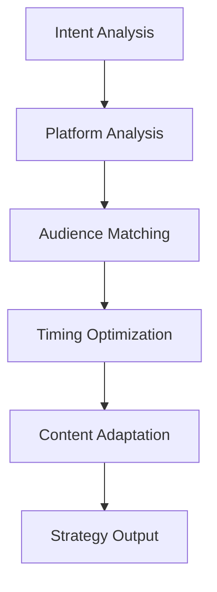

# ZenAlto Agent Architecture

## Overview

ZenAlto's agent architecture is built on DeepCode's proven multi-agent orchestration system, adapted for social media management. The system uses specialized AI agents that work together to transform conversational input into optimized social media content.

## Agent Hierarchy

```
Agent Orchestration Engine
├── Content Intent Agent (Primary Analysis)
├── Content Strategy Agent (Planning & Optimization)
├── Content Generation Agent (Creation & Synthesis)
├── Social Content Parser (Content Processing)
├── Analytics Agent (Performance Analysis)
└── Scheduling Agent (Timing & Queue Management)
```

## Core Agents

### 1. Content Intent Agent

**Location**: `workflows/agents/content_intent_agent.py`
**Purpose**: Analyzes user requests to understand content goals and requirements

#### Key Methods

```python
class ContentIntentAgent:
    async def analyze_content_intent(
        self,
        user_request: str,
        conversation_history: List[Dict[str, Any]] = None,
        platform_context: Dict[str, Any] = None
    ) -> Dict[str, Any]:
        """
        Main entry point for intent analysis

        Args:
            user_request: Natural language content request
            conversation_history: Previous conversation context
            platform_context: Current platform connection status

        Returns:
            Structured intent analysis
        """
```

#### Intent Analysis Flow

1. **Input Processing**: Parse user request and conversation context
2. **Platform Detection**: Identify target social media platforms
3. **Audience Analysis**: Determine target audience demographics
4. **Content Classification**: Categorize content type and requirements
5. **Context Integration**: Incorporate user preferences and history
6. **Output Structuring**: Format results for downstream agents

#### Example Usage

```python
# Initialize agent
intent_agent = ContentIntentAgent(mcp_agent, logger)

# Analyze user request
result = await intent_agent.analyze_content_intent(
    "Create an engaging LinkedIn post about AI automation trends",
    conversation_history=previous_messages,
    platform_context={"linkedin": {"connected": True}}
)

# Result structure
{
    "intent_summary": "Create engaging post about AI automation trends",
    "platforms": ["linkedin"],
    "audience": "Business professionals",
    "content_type": "Professional post",
    "tone": "Professional",
    "topics": ["AI", "automation", "trends"],
    "urgency": "Normal",
    "additional_requirements": []
}
```

### 2. Content Strategy Agent

**Purpose**: Plans optimal content distribution and timing strategies

#### Key Responsibilities

- **Platform Selection**: Choose best platforms for content type
- **Timing Optimization**: Determine optimal posting times
- **Audience Targeting**: Match content to audience preferences
- **Campaign Planning**: Design multi-post campaign strategies
- **Performance Prediction**: Estimate engagement potential

#### Strategy Decision Flow



### 3. Content Generation Agent

**Purpose**: Creates optimized content for each target platform

#### Generation Pipeline

1. **Template Selection**: Choose appropriate content templates
2. **Platform Adaptation**: Modify content for platform requirements
3. **Hashtag Generation**: Create relevant hashtags
4. **Media Integration**: Suggest appropriate media assets
5. **Tone Adjustment**: Match content tone to platform and audience

#### Content Templates

```python
CONTENT_TEMPLATES = {
    "twitter": {
        "thread": "Thread template for Twitter threads",
        "single": "Single post template for Twitter",
        "poll": "Poll template for Twitter"
    },
    "linkedin": {
        "article": "Article-style post for LinkedIn",
        "update": "Status update for LinkedIn",
        "question": "Question post for LinkedIn"
    },
    "instagram": {
        "carousel": "Multi-image carousel post",
        "reel": "Short video content",
        "story": "Story content"
    }
}
```

### 4. Social Content Parser

**Purpose**: Processes existing content and social media data

#### Parsing Capabilities

- **URL Content Extraction**: Parse content from URLs
- **Social Media Import**: Import existing posts from platforms
- **Content Analysis**: Extract themes, topics, and sentiment
- **Performance Analysis**: Analyze engagement patterns
- **Trend Detection**: Identify content trends and patterns

### 5. Analytics Agent

**Purpose**: Tracks and analyzes social media performance

#### Analytics Features

- **Engagement Tracking**: Monitor likes, shares, comments, clicks
- **Performance Prediction**: Forecast content performance
- **Trend Analysis**: Identify optimal content types and timing
- **Competitor Analysis**: Compare performance with competitors
- **Reporting**: Generate comprehensive performance reports

#### Analytics Data Structure

```python
analytics_data = {
    "post_id": "1234567890",
    "platform": "twitter",
    "metrics": {
        "impressions": 1500,
        "engagements": 45,
        "engagement_rate": 0.03,
        "clicks": 12,
        "shares": 3,
        "comments": 8,
        "likes": 22
    },
    "demographics": {
        "age_groups": {"18-24": 0.2, "25-34": 0.4, "35-44": 0.3, "45+": 0.1},
        "gender": {"male": 0.6, "female": 0.4},
        "locations": {"US": 0.5, "UK": 0.2, "Canada": 0.15, "Other": 0.15}
    },
    "timing": {
        "posted_at": "2025-01-15T14:30:00Z",
        "best_engagement_hour": 14,
        "peak_engagement_window": "2-4 hours after posting"
    }
}
```

### 6. Scheduling Agent

**Purpose**: Manages content posting schedules and queues

#### Scheduling Features

- **Optimal Timing**: Calculate best posting times based on analytics
- **Queue Management**: Handle posting queues and priorities
- **Batch Scheduling**: Schedule multiple posts simultaneously
- **Recurring Content**: Manage recurring post schedules
- **Conflict Resolution**: Handle scheduling conflicts

## Agent Communication

### Message Passing

Agents communicate through structured messages using the MCP protocol:

```python
# Agent communication message structure
message = {
    "sender": "content_intent_agent",
    "receiver": "content_generation_agent",
    "message_type": "intent_analysis_complete",
    "payload": {
        "intent_data": {...},
        "context": {...},
        "metadata": {...}
    },
    "timestamp": "2025-01-15T10:00:00Z",
    "correlation_id": "session_12345"
}
```

### Coordination Patterns

1. **Sequential Processing**: Intent → Strategy → Generation → Scheduling
2. **Parallel Processing**: Multiple platforms processed simultaneously
3. **Feedback Loop**: Analytics inform future content decisions
4. **Error Recovery**: Failed operations trigger retry mechanisms

## Agent Configuration

### Configuration Structure

```yaml
# Agent configuration in mcp_agent.config.yaml
agents:
  content_intent:
    enabled: true
    model: "anthropic/claude-3.5-sonnet"
    max_tokens: 2000
    temperature: 0.7

  content_generation:
    enabled: true
    model: "anthropic/claude-3.5-sonnet"
    max_tokens: 4000
    temperature: 0.8

  analytics:
    enabled: true
    update_interval: 3600  # seconds
    retention_period: 90   # days

  scheduling:
    enabled: true
    max_queue_size: 100
    retry_attempts: 3
    retry_delay: 300  # seconds
```

### Environment-Specific Settings

```python
# Development settings
DEV_CONFIG = {
    "agents": {
        "debug_mode": True,
        "mock_external_apis": True,
        "log_level": "DEBUG"
    }
}

# Production settings
PROD_CONFIG = {
    "agents": {
        "debug_mode": False,
        "mock_external_apis": False,
        "log_level": "INFO",
        "performance_monitoring": True
    }
}
```

## Error Handling

### Agent Error Types

1. **API Errors**: Platform API failures
2. **Rate Limiting**: Exceeded API rate limits
3. **Authentication Errors**: Invalid or expired credentials
4. **Content Validation Errors**: Content doesn't meet platform requirements
5. **Network Errors**: Connectivity issues
6. **Processing Errors**: Internal agent processing failures

### Error Recovery Strategies

```python
class AgentErrorHandler:
    async def handle_error(self, error: Exception, agent_name: str, context: Dict) -> Dict:
        """
        Centralized error handling for all agents

        Args:
            error: The exception that occurred
            agent_name: Name of the agent that failed
            context: Error context and metadata

        Returns:
            Recovery action or error response
        """

        if isinstance(error, RateLimitError):
            # Implement exponential backoff
            delay = self.calculate_backoff_delay(context.get("retry_count", 0))
            return {
                "action": "retry",
                "delay": delay,
                "max_retries": 3
            }

        elif isinstance(error, AuthenticationError):
            # Trigger re-authentication
            return {
                "action": "reauthenticate",
                "platform": context.get("platform"),
                "redirect_url": self.generate_oauth_url(context.get("platform"))
            }

        elif isinstance(error, ContentValidationError):
            # Attempt content correction
            return {
                "action": "correct_content",
                "corrections": self.generate_corrections(error, context)
            }

        else:
            # Log and escalate
            await self.log_error(error, agent_name, context)
            return {
                "action": "escalate",
                "error_details": str(error),
                "severity": "high"
            }
```

## Performance Optimization

### Caching Strategies

```python
class AgentCache:
    def __init__(self):
        self.redis_client = redis.Redis(host='localhost', port=6379, db=0)
        self.cache_ttl = {
            "intent_analysis": 3600,    # 1 hour
            "platform_status": 300,     # 5 minutes
            "analytics_data": 1800,     # 30 minutes
            "user_preferences": 86400   # 24 hours
        }

    async def get_cached_result(self, key: str, agent_type: str) -> Optional[Dict]:
        """Retrieve cached agent result"""
        cached = self.redis_client.get(f"{agent_type}:{key}")
        return json.loads(cached) if cached else None

    async def cache_result(self, key: str, agent_type: str, result: Dict):
        """Cache agent result with appropriate TTL"""
        ttl = self.cache_ttl.get(agent_type, 3600)
        self.redis_client.setex(
            f"{agent_type}:{key}",
            ttl,
            json.dumps(result)
        )
```

### Concurrent Processing

```python
class ConcurrentAgentProcessor:
    async def process_multiple_platforms(self, content: Dict, platforms: List[str]) -> Dict:
        """
        Process content for multiple platforms concurrently

        Args:
            content: Base content to adapt
            platforms: List of target platforms

        Returns:
            Platform-specific content variations
        """
        tasks = []
        for platform in platforms:
            task = asyncio.create_task(
                self.adapt_content_for_platform(content, platform)
            )
            tasks.append(task)

        # Wait for all platform adaptations to complete
        results = await asyncio.gather(*tasks, return_exceptions=True)

        # Process results and handle any exceptions
        platform_content = {}
        for platform, result in zip(platforms, results):
            if isinstance(result, Exception):
                logger.error(f"Failed to adapt content for {platform}: {str(result)}")
                platform_content[platform] = {"error": str(result)}
            else:
                platform_content[platform] = result

        return platform_content
```

## Testing

### Unit Tests

```python
import pytest
from workflows.agents.content_intent_agent import ContentIntentAgent

class TestContentIntentAgent:
    @pytest.fixture
    async def agent(self):
        return ContentIntentAgent(mock_mcp_agent, mock_logger)

    @pytest.mark.asyncio
    async def test_analyze_simple_request(self, agent):
        request = "Post about AI on Twitter"
        result = await agent.analyze_content_intent(request)

        assert result["platforms"] == ["twitter"]
        assert "AI" in result["topics"]
        assert result["content_type"] == "Social media post"

    @pytest.mark.asyncio
    async def test_analyze_complex_request(self, agent):
        request = "Create a professional LinkedIn post about our new AI product launch targeting tech executives"
        result = await agent.analyze_content_intent(request)

        assert result["platforms"] == ["linkedin"]
        assert result["tone"] == "Professional"
        assert "tech executives" in result["audience"].lower()
```

### Integration Tests

```python
class TestAgentIntegration:
    @pytest.mark.asyncio
    async def test_full_content_workflow(self):
        # Test complete workflow: Intent → Generation → Posting
        intent_result = await intent_agent.analyze_content_intent(
            "Create an engaging Twitter thread about AI trends"
        )

        generation_result = await generation_agent.generate_content(
            intent_result, ["twitter"]
        )

        posting_result = await social_server.post_content(
            "twitter", generation_result["twitter"]
        )

        assert posting_result["success"] == True
        assert "post_id" in posting_result
```

### Mock Setup

```python
@pytest.fixture
def mock_mcp_agent():
    """Mock MCP agent for testing"""
    class MockMCPAgent:
        async def call_tool(self, tool_name, params):
            if tool_name == "content_intent_analysis":
                return '{"intent_summary": "Test intent", "platforms": ["twitter"]}'
            return "{}"
    return MockMCPAgent()

@pytest.fixture
def mock_social_server():
    """Mock social media server for testing"""
    class MockSocialServer:
        async def post_content(self, platform, content):
            return {
                "success": True,
                "post_id": f"mock_{platform}_123",
                "url": f"https://{platform}.com/status/mock_123"
            }
    return MockSocialServer()
```

## Monitoring & Observability

### Agent Metrics

```python
class AgentMetrics:
    def __init__(self):
        self.metrics = {
            "intent_analysis": {
                "requests_total": 0,
                "success_rate": 0.0,
                "average_response_time": 0.0
            },
            "content_generation": {
                "requests_total": 0,
                "success_rate": 0.0,
                "average_response_time": 0.0
            },
            "platform_posting": {
                "requests_total": 0,
                "success_rate": 0.0,
                "average_response_time": 0.0
            }
        }

    def record_metric(self, agent_type: str, success: bool, response_time: float):
        """Record agent performance metrics"""
        if agent_type in self.metrics:
            self.metrics[agent_type]["requests_total"] += 1

            # Update success rate
            current_successes = self.metrics[agent_type]["success_rate"] * (self.metrics[agent_type]["requests_total"] - 1)
            new_success_rate = (current_successes + (1 if success else 0)) / self.metrics[agent_type]["requests_total"]
            self.metrics[agent_type]["success_rate"] = new_success_rate

            # Update average response time
            current_avg = self.metrics[agent_type]["average_response_time"]
            current_count = self.metrics[agent_type]["requests_total"] - 1
            self.metrics[agent_type]["average_response_time"] = (
                (current_avg * current_count) + response_time
            ) / self.metrics[agent_type]["requests_total"]
```

### Logging

```python
import logging
import json
from datetime import datetime

class AgentLogger:
    def __init__(self, agent_name: str):
        self.agent_name = agent_name
        self.logger = logging.getLogger(f"zenalto.agents.{agent_name}")

        # Configure structured logging
        formatter = logging.Formatter(
            json.dumps({
                "timestamp": "%(asctime)s",
                "level": "%(levelname)s",
                "agent": agent_name,
                "message": "%(message)s",
                "extra": "%(extra)s"
            })
        )

        handler = logging.StreamHandler()
        handler.setFormatter(formatter)
        self.logger.addHandler(handler)
        self.logger.setLevel(logging.INFO)

    def log_request(self, request_data: Dict, correlation_id: str):
        """Log incoming agent request"""
        self.logger.info(
            "Agent request received",
            extra={
                "correlation_id": correlation_id,
                "request_type": request_data.get("type", "unknown"),
                "request_size": len(json.dumps(request_data))
            }
        )

    def log_response(self, response_data: Dict, correlation_id: str, duration: float):
        """Log agent response"""
        self.logger.info(
            "Agent response sent",
            extra={
                "correlation_id": correlation_id,
                "response_type": response_data.get("type", "unknown"),
                "duration_ms": duration * 1000,
                "success": response_data.get("success", False)
            }
        )

    def log_error(self, error: Exception, correlation_id: str, context: Dict = None):
        """Log agent error"""
        self.logger.error(
            f"Agent error: {str(error)}",
            extra={
                "correlation_id": correlation_id,
                "error_type": type(error).__name__,
                "context": json.dumps(context or {})
            }
        )
```

## Future Enhancements

### Advanced Agent Features

1. **Learning Agents**: Agents that improve performance over time
2. **Collaborative Agents**: Multiple agents working on complex tasks
3. **Specialized Agents**: Platform-specific optimization agents
4. **Predictive Agents**: Agents that forecast content performance

### Scalability Improvements

1. **Agent Pooling**: Multiple instances of agents for high load
2. **Load Balancing**: Distribute work across agent instances
3. **Horizontal Scaling**: Deploy agents across multiple servers
4. **Caching Optimization**: Advanced caching strategies for performance

### Intelligence Enhancements

1. **Context Awareness**: Better understanding of user context and preferences
2. **Trend Analysis**: Real-time social media trend detection
3. **Competitor Intelligence**: Automated competitor analysis
4. **Personalization**: Highly personalized content recommendations

This agent architecture provides a solid foundation for ZenAlto's social media management capabilities while maintaining the flexibility to evolve with new requirements and technologies.</content>
<parameter name="filePath">/workspaces/DeepCode/ZENALTO_AGENT_ARCHITECTURE.md
